# Silent Hill 4 Auto Splitter

This repository contains a small collection of auto splitters used by LiveSplit
for the game 'Silent Hill 4: The Room'.

* a room-based Any% auto splitter
* a level-based Any% auto splitter

## Install

### Getting The Files

To use one of these auto splitters with LiveSplit, extract the files from one
of the subdirectories to get started. Each subdirectory should contain:

* an *.asl file that contains the auto splitter script
* an *.lss file that contains the splits that go with the auto splitter script

Save these files locally, where you can easily access them.

### Making a New Layout

Start a new layout in LiveSplit, and make sure to add the following components:

* Timer > (Detailed) Timer
* List > (Sub)Splits
* Control > Scriptable Auto Splitter

If the auto splitter uses subsplits, you should use the subsplits component.
An in-depth can be found below to get you started.

### Configuration

To add the auto splitter, open the 'Scriptable Auto Splitter' tab in the layout
settings menu, and add the script's filepath. This is the file with the .asl
file extension. If everything goes well, the greyed out boxes 'start', 'split',
and 'reset' should become selectable checkboxes. Make sure that all of these
are checked.

Silent Hill 4 speedruns use the in-game timer. To ensure that the in-game time
is used, set the following options in the layout settings (if applicable):

* '(Sub)splits > Columns > Column: +/- > Timing Method' = 'Game Time'
* '(Sub)splits > Columns > Column: Time > Timing Method' = 'Game Time'
* 'Subsplits > Section Header > Timing Method' = 'Game Time'
* 'Timer > Timing Method > Timing Method' = 'Game Time'

Now you can further change the layout settings to your liking. Done.

### Full Configuration Guide: Any% Room-Based Auto Splitter

#### Step 1: Downloading Auto Splitter

You can download a copy of this repository by clicking the download button in
the upper-right corner of this page. Extracts the files that you need from the 
.zip archive to a location that you can access easily (e.g. your desktop).

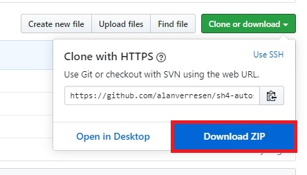

In this guide, we will need the following files:

* *auto splitter script*: **<location>/rooms, any%/sh4.asl**
* *splits*: **<location>/rooms, any%/Silent Hill 4 The Room - Any%, NTCS-U, PC.lss**

#### Step 2: Opening A New Layout In LiveSplit

The first step in creating a new layout is opening LiveSplit. LiveSplit will
load a fresh default layout if it is your first time using LiveSplit. If it is
not your first time using LiveSplit, you can load a new default layout by
right-clicking anywhere on the LiveSplit window, and selecting 'Open Layout > 
Default'. The window should look something like this:

#### Step 3: Adding Splits

To load the splits of the room-based auto splitter, do the following:

1. Right-click anywhere on the LiveSplit window, and select 'Open Splits > From
   File'.

   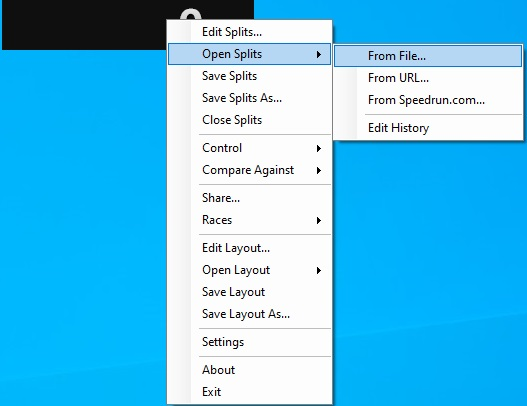

2. Select the file containing the splits for the room-based auto splitter.

   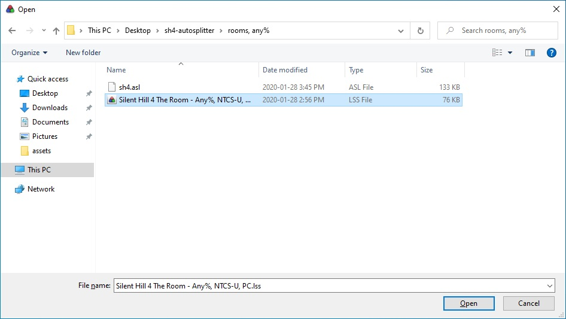

3. The LiveSplit window should now look like the image below.

   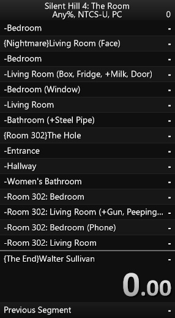

#### Step 4: Layout Configuration

Not only does the current layout of the LiveSplit window look a bit weird, but
it simply just doesn't work properly at the moment. We need to configure it
further to use the correct timers, and load the auto splitter script.

1. Right-click anywhere on the LiveSplit window, and select 'Edit Layout...'.

   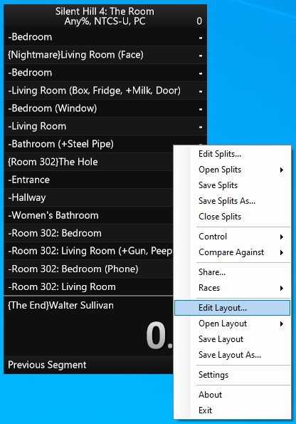

2. Use the '+' button to add components, the '-' button to remove components,
   and the arrows to move the order of the layout's components. These new
   components are:
   
   * Timer > (Detailed) Timer
   * List > Subsplits
   * Control > Scriptable Auto Splitter
   
   The result should look like the image below:
   
   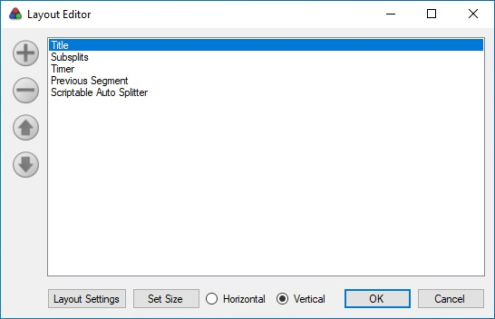

3. We need to further configure these individual components, so double-click on
   the 'Layout Settings' in the bottom-left corner.
   
4. Silent Hill 4 speedruns use the in-game timer instead of using real time, so
   we need to change the timing methods used by our components.

   * 'Subsplits > Section Header > Timing Method' = 'Game Time'
   * 'Subsplits > Columns > Column: +/- > Timing Method' = 'Game Time'
   * 'Subsplits > Columns > Column: Time > Timing Method' = 'Game Time'
   * 'Timer > Timing Method > Timing Method' = 'Game Time'

    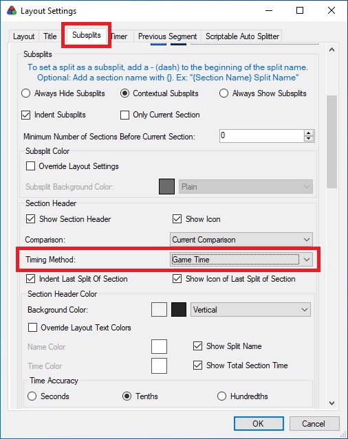
    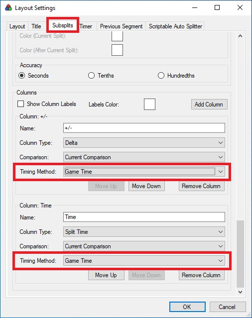
    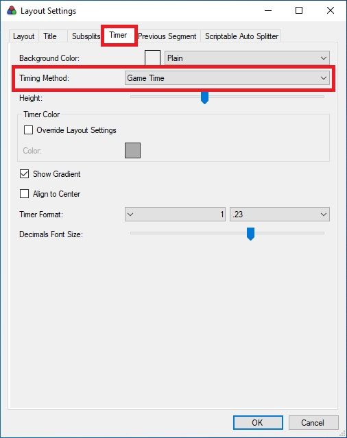

4. We also need to load the auto splitter script. In the 'Scriptable Auto
   Splitter' tab, select the auto splitter script. If successfully loaded, the
   checkboxes should be populated with checkmarks. Otherwise, the checkboxes
   will stay greyed out.
   
   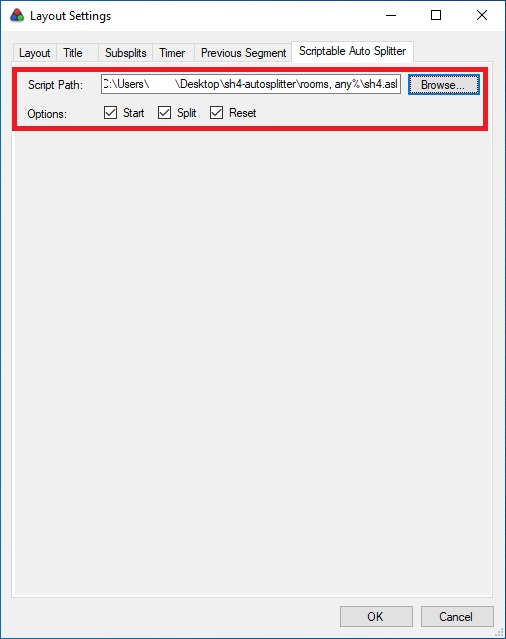

#### Step 5: Save Settings

After we have successfully loaded our splits, and correctly configured the
layout of our LiveSplit window, we should save the settings.

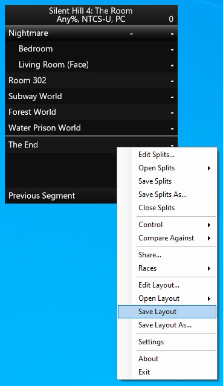

This will create a new *.lsl file that we can use to reload this setting.

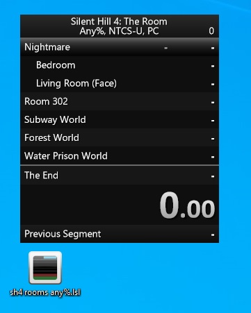

#### Step 6: Configure LiveSplit Window Further

If you do not like the current aesthetic of the LiveSplit window, you can
further configure the layout in the Layout Settings window that was used
earlier to change the component's settings.

Don't forget to save your changes, and... done! You are ready to speedrun SH4!
