# Installation Guide: Any% Level-Based Auto Splitter

## Step 1: Downloading Auto Splitter

To use one of these auto splitters with LiveSplit, extract the files from one
of the subdirectories to get started. Each subdirectory should contain:

* an *.asl file that contains the auto splitter script
* an *.lss file that contains the splits that go with the auto splitter script

Save these files locally, where you can easily access them. In this guide, we
will need the following files:

* **<location>/levels, any%/sh4.asl**
* **<location>/levels, any%/Silent Hill 4 The Room - Any%, NTCS-U, PC.lss**

You can download a copy of this repository by clicking the download button in
the upper-right corner of this page. Extract the files that you need from the 
.zip archive to a location that you can access easily (e.g. your desktop).

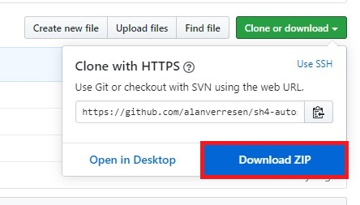

## Step 2: Opening A New Layout In LiveSplit

The first step in creating a new layout is opening LiveSplit. LiveSplit will
load a fresh default layout if it is your first time using LiveSplit. If it is
not your first time using LiveSplit, you can load a new default layout by
right-clicking anywhere on the LiveSplit window, and selecting 'Open Layout > 
Default'. The new LiveSplit window should look something like this:

#### Step 3: Adding Splits

To load the splits of the level-based auto splitter, do the following:

1. Right-click anywhere on the LiveSplit window, and select 'Open Splits > From
   File'.

   

2. Select the file containing the splits for the level-based auto splitter.

   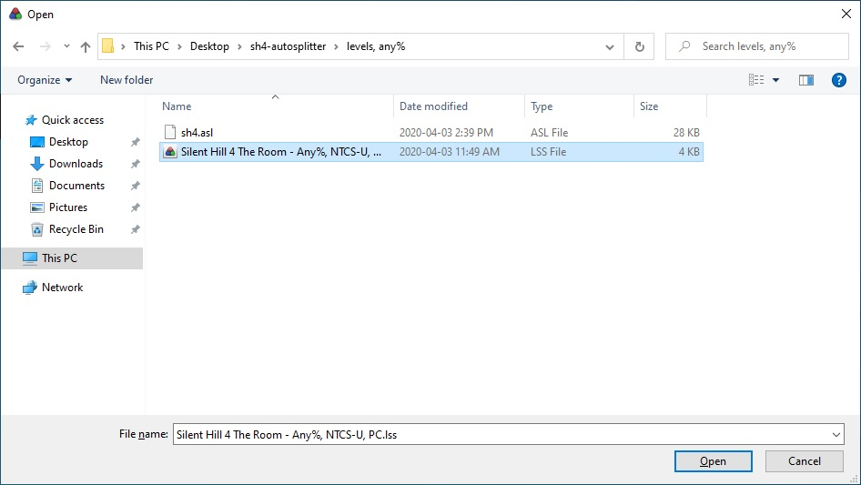

3. The LiveSplit window should now look like the image below.

   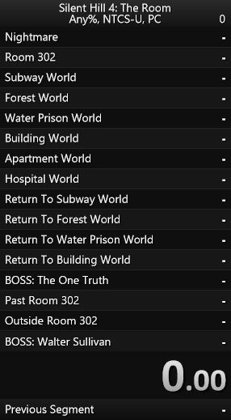

#### Step 4: Layout Configuration

Not only does the current layout of the LiveSplit window look a bit weird, but
it also doesn't work properly at the moment. We need to configure it further to
use the correct timers, and load the auto splitter script.

1. Right-click anywhere on the LiveSplit window, and select 'Edit Layout...'.

   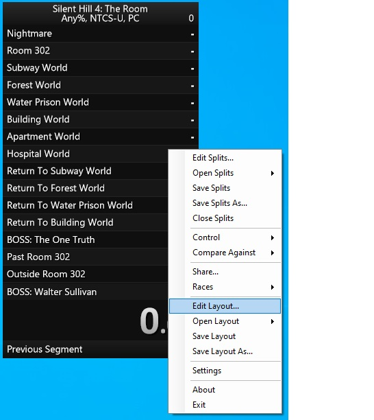

2. Use the '+' button to add components, the '-' button to remove components,
   and the arrows to move the order of the layout's components. The components
   that we will need are:
   
   * Timer > (Detailed) Timer
   * List > Splits
   * Control > Scriptable Auto Splitter
   
   The result should look like the image below:
   
   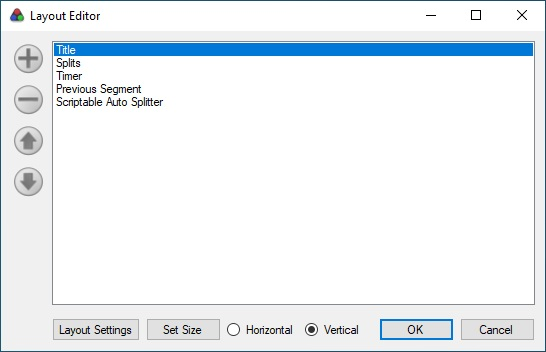

3. We need to further configure these individual components, so double-click on
   the 'Layout Settings' button in the bottom-left corner. This window can be
   used to change the general layout of the LiveSplit window, and the settings
   of our components.

4. Silent Hill 4 speedruns use the in-game timer instead of using real time, so
   we need to change the timing methods used by our components.

   * 'Splits > Columns > Column: +/- > Timing Method' = 'Game Time'
   * 'Splits > Columns > Column: Time > Timing Method' = 'Game Time'
   * 'Timer > Timing Method > Timing Method' = 'Game Time'

    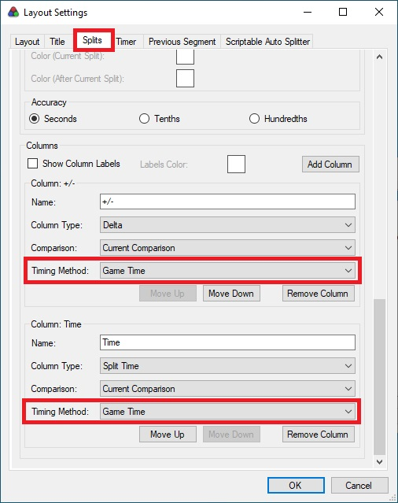
    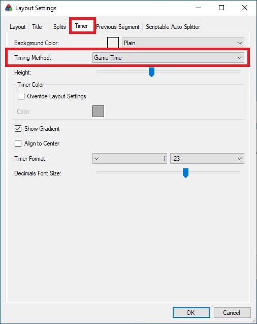
    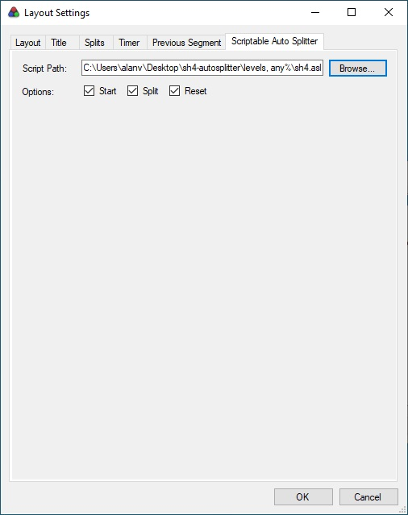

4. We also need to load the auto splitter script. In the 'Scriptable Auto
   Splitter' tab, click the browse button, and select the auto splitter script's
   file. If successfully loaded, the checkboxes should be populated with
   checkmarks. Otherwise, the checkboxes will stay greyed out.
   
   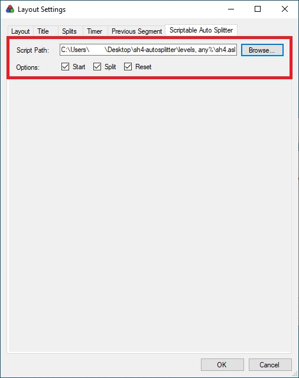

#### Step 5: Save Settings

After successfully loading our splits, and correctly configuring the layout of
our LiveSplit window, we should save the settings.

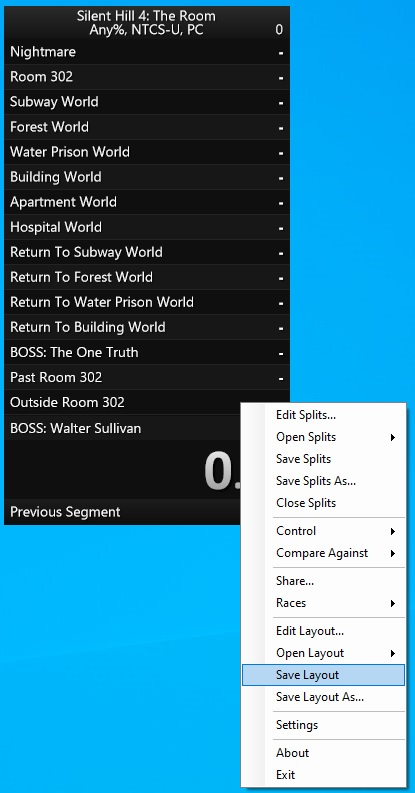

This will create a new .lsl file that we can use to reload the splits and 
layout.

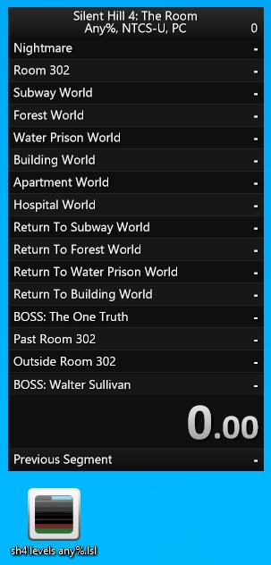

#### Step 6: Configure LiveSplit Window Further

If you do not like the current aesthetic of the LiveSplit window, you can
further configure the layout in the Layout Settings window that was used
earlier to change the component's settings.

Don't forget to save your changes, and... done! You are ready to speedrun SH4!